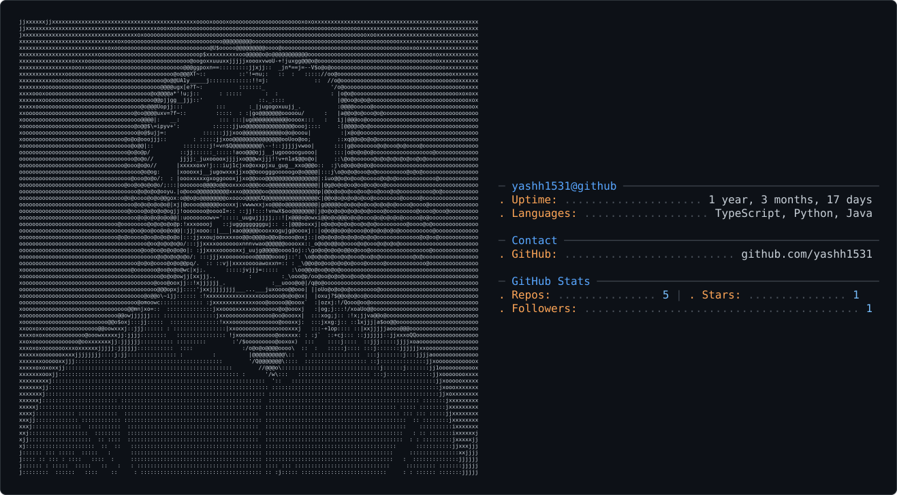

<picture>
  <source media="(prefers-color-scheme: dark)" srcset="dark_mode.svg" />
  
</picture>

<svg xmlns="http://www.w3.org/2000/svg" width="1317" height="728" viewBox="0 0 1317 728" role="img" aria-label="ASCII GitHub profile card for yashh1531">
  <rect x="0.5" y="0.5" width="1316" height="727" rx="8" fill="#ffffff" stroke="#d0d7de"/>
  <text x="28" y="34.6" fill="#24292f" font-family="'Consolas', 'Menlo', 'DejaVu Sans Mono', monospace" xml:space="preserve" font-size="8">xxxxxxxxxxxxxxxxxxxxjjjxjjjjjjjjjjjjjjjjjjjjjjjjjjjjjjjjjjjjjjjjjjjjjjjjjjjjjjjjjjjjjjjjjjjjjjjjjjjjjjjjjjjjjjjjjjjjjjjjjjjjjjxjjxxxxxxxxxxx</text>
  <text x="28" y="44.2" fill="#24292f" font-family="'Consolas', 'Menlo', 'DejaVu Sans Mono', monospace" xml:space="preserve" font-size="8">xxxxxxxxxxxxxxxxjjjjjjjjjjjjjjjjjjjjjjjjjjjjjjjjjjjjjjjjjjjjjjjjjj:j:j:j:jj:jjjjjjjjjjjjjjjjjjjjjjjjjjjjjjjjjjjjjjjjjjjjjjjjjjjjjjjjjxxxxxxx</text>
  <text x="28" y="53.8" fill="#24292f" font-family="'Consolas', 'Menlo', 'DejaVu Sans Mono', monospace" xml:space="preserve" font-size="8">xxxxxxxxxxxxxxjjjjjjjjjjjjjjjjjjjjjjjjjjjjjjjjjjjjjjjj:j:j:j:::::jj:j:j:j:j:j::::::::j:jjjjjjjjjjjjjjjjjjjjjjjjjjjjjjjjjjjjjjjjjjjjjjjjjjxxx</text>
  <text x="28" y="63.400000000000006" fill="#24292f" font-family="'Consolas', 'Menlo', 'DejaVu Sans Mono', monospace" xml:space="preserve" font-size="8">xxxxxxxxxxxjjjjjjjjjjjjjjjjjjjjjjjjjjjjjjjjjjjjjj:j:j:j:j:::::'::   ::'::::::::::j::::j:::j:j:jjj:jjjjjjjjjjjjjjjjjjjjjjjjjjjjjjjjjjjjjjjjxx</text>
  <text x="28" y="73" fill="#24292f" font-family="'Consolas', 'Menlo', 'DejaVu Sans Mono', monospace" xml:space="preserve" font-size="8">xxxxxjjxxjjjjjjjjjjjjjjjjjjjjjjjjjjjjjjjjjj:j::j:j:::::::::__:j_j::       :::::::::::::::::::::::j:::j:j:jjjjjjjjjjjjjjjjjjjjjjjjjjjjjjjjjjx</text>
  <text x="28" y="82.6" fill="#24292f" font-family="'Consolas', 'Menlo', 'DejaVu Sans Mono', monospace" xml:space="preserve" font-size="8">xxjjjjjjjjjjjjjjjjjjjjjjjjjjjjjjjjj:j:j:j:j::j::::::::::_jjjjxxxxjjj:.   :::::         ::::::::j::j:::::j:j:jjjjjjjjjjjjjjjjjjjjjjjjjjjjjjjj</text>
  <text x="28" y="92.2" fill="#24292f" font-family="'Consolas', 'Menlo', 'DejaVu Sans Mono', monospace" xml:space="preserve" font-size="8">xjjjjjjjjjjjjjjjjjjjjjjjjjjjjjjjj:jj:j::::::::::::::::j~jjjvxvxxxxxxxxj::ju_j_-ggxnv-'   ::::::::::::::::j:j:j:j:jjjjjjjjjjjjjjjjjjjjjjjjjjj</text>
  <text x="28" y="101.8" fill="#24292f" font-family="'Consolas', 'Menlo', 'DejaVu Sans Mono', monospace" xml:space="preserve" font-size="8">jjjjjjjjjjjjjjjjjjjjjjjjjjjjjjjjjj::j:j:::::::::::: _'-:jjjugooo@@oooooxxxooo@@pujuggxgu-__.::::::::::::::::::::j:jjjj:jjjjjjjjjjjjjjjjjjjjj</text>
  <text x="28" y="111.39999999999999" fill="#24292f" font-family="'Consolas', 'Menlo', 'DejaVu Sans Mono', monospace" xml:space="preserve" font-size="8">jjjjjjjjjjjjjjjjjjjjjjjjjjjjjjj:::j::::::::::::::   __go@@@@@@@@@@@@@ogguja@@@@@o@@o@@@@@@@@//:::::::::::::j:j:j:j:j:jj:j:j:jjjjjjjjjjjjjjjj</text>
  <text x="28" y="121" fill="#24292f" font-family="'Consolas', 'Menlo', 'DejaVu Sans Mono', monospace" xml:space="preserve" font-size="8">jjjjjjjjjjjjjjjjjjjjjjjjj:jj:jjjj:j:::::::::::: __j1fY5AXxoooo@o@o@ooooogxxo@@@@@@@@@@@@@@o@@@//::::::::::::::j:j:::::j:j:j:j:jjjjjjjjjjjjjj</text>
  <text x="28" y="130.6" fill="#24292f" font-family="'Consolas', 'Menlo', 'DejaVu Sans Mono', monospace" xml:space="preserve" font-size="8">jjjjjjjjjjjjjjjjjjjjjjjj:j:j::::::::::::::::   z!xu___go@@@@@@@@@@@@ooooooQ@@@@@@@@@@@@@@@@@@@@@/::::::::::::::j:j:::::j:j:j:jjjjjjjjjjjjjjj</text>
  <text x="28" y="140.2" fill="#24292f" font-family="'Consolas', 'Menlo', 'DejaVu Sans Mono', monospace" xml:space="preserve" font-size="8">jjjjjjjjjjjjjjjj:jjjjjjjj:j::j::::::::::::   \;_gpnwoo@@@@@@@@@@o@o@@@@@@@@@@@@@@@@@@@@@@@@@@@@@@|::::::::::::::::::::::::::::j:jjjjjjjjjjjj</text>
  <text x="28" y="149.8" fill="#24292f" font-family="'Consolas', 'Menlo', 'DejaVu Sans Mono', monospace" xml:space="preserve" font-size="8">jjjjjjjjjjjjjjjjjjjjjj:j:j:::::::::::::::: |xx:-Yenxxoo@@@@@@@@@@@@@@@@@@@oo$ooo@@@@@@@@@@@@@@@@@| :::::::::::::::::::j::::::::j:j:jjjjjjjjj</text>
  <text x="28" y="159.4" fill="#24292f" font-family="'Consolas', 'Menlo', 'DejaVu Sans Mono', monospace" xml:space="preserve" font-size="8">jjjjjjjjjjjjj:j::::j:jj:::::::::::::::::  _.|xx@oo@@@@@@@@@@@o@@@@@@@@@Uwov=:!!jvnoxoo@@@@@@@@@@@o   :::::::::::::::::::j:::::::::j:jjjjjjjj</text>
  <text x="28" y="169" fill="#24292f" font-family="'Consolas', 'Menlo', 'DejaVu Sans Mono', monospace" xml:space="preserve" font-size="8">jjjjjjjjjjjjjj:jj:j::::j:::::::::::::::   [xug_ug@@@@@@@@@@@@o@o@@@@@ow=':     ::::jj1$@@@@@@@@@@o;  ::::::::::::::::::::::::::::::j:jjjjjjj</text>
  <text x="28" y="178.6" fill="#24292f" font-family="'Consolas', 'Menlo', 'DejaVu Sans Mono', monospace" xml:space="preserve" font-size="8">jjjjjjjjjjj:j:j:j::j:j::::::::::::::::   |o@@@U$@@@@@@@@@@@@@o@o@@oow\'         :::::jjo@@@@@o@@@po|  ::::::::::::::::::::::::::::::j:j:jjjj</text>
  <text x="28" y="188.2" fill="#24292f" font-family="'Consolas', 'Menlo', 'DejaVu Sans Mono', monospace" xml:space="preserve" font-size="8">jjjjjjjjj:j:j:j:j:j:j:j:j::::::::::::: _\gy|uugo@@@@@@@@@@@@o@ooooxx::          : ::::jxooo@@@@@@@;.   :::::::::::::::::::::::::::j::j:j:jjj</text>
  <text x="28" y="197.79999999999998" fill="#24292f" font-family="'Consolas', 'Menlo', 'DejaVu Sans Mono', monospace" xml:space="preserve" font-size="8">jjjjjjj:jj:j:j:j:j:j::j::::::::::::::: .1xxgo@@@@@@@@@@@@@o@oooxxjj:   :       ::::::::|o@@@@@@@@@o|j :::::::::::::::::::::::::::::::j:jjjjj</text>
  <text x="28" y="207.4" fill="#24292f" font-family="'Consolas', 'Menlo', 'DejaVu Sans Mono', monospace" xml:space="preserve" font-size="8">jjjjjjj:j:::::::j:::j::j::::::::::::::jjoooo@@@@@@@@@@@oo@oooxjj'              ..__::::j1@@@@@@@@@ox| ::::::::::::::::::::::::::::::::j:j:jj</text>
  <text x="28" y="217" fill="#24292f" font-family="'Consolas', 'Menlo', 'DejaVu Sans Mono', monospace" xml:space="preserve" font-size="8">jjj:j:j::j::::::::::::::::::::::::::::|@@@@@@@@@@@@ooooooooogu___.       ._--gooooooxu;:j|@@@@@@@oo|::::::::::::::::::::::::::::::::::::j:jj</text>
  <text x="28" y="226.6" fill="#24292f" font-family="'Consolas', 'Menlo', 'DejaVu Sans Mono', monospace" xml:space="preserve" font-size="8">jjjjj::::::::::j:j:j:j::::::::::::::::[q@@@@@@@@@@oxoo@@@oo@o@o@og/::  :jxoU$wx!::::!!1j:j|@@@@@ooo|:::::::::::::::::::::::::::::::::::::j:j</text>
  <text x="28" y="236.2" fill="#24292f" font-family="'Consolas', 'Menlo', 'DejaVu Sans Mono', monospace" xml:space="preserve" font-size="8">j:j:jj:j::::::::::::::j:::::::::::::::://@@@@@@@@xxxxowovjj:jjxxxxxxj   |xxxogguguuj_::: :|@@@@@o@\:::::::::::::::::::::::::::::::::::::::jj</text>
  <text x="28" y="245.79999999999998" fill="#24292f" font-family="'Consolas', 'Menlo', 'DejaVu Sans Mono', monospace" xml:space="preserve" font-size="8">jj:j:::::j:::::::j:::::::::::::::::::::://@@@@@@|xjjjjjjugoooo}{xxaoj: :jj|nj[Y++=V5xj::  |oo@@oo\::::::::::::::::::::::::::::::::::::::::::</text>
  <text x="28" y="255.39999999999998" fill="#24292f" font-family="'Consolas', 'Menlo', 'DejaVu Sans Mono', monospace" xml:space="preserve" font-size="8">j:j:j::::::::::::::::::::::::::::::::::::!o@@@@@|jjjjjxoUUnn=j_jjjxoj: :jj:!+!jj::!'::::   |o@ow\:::::::::::::::::::::::::::::::::::::::::j:</text>
  <text x="28" y="265" fill="#24292f" font-family="'Consolas', 'Menlo', 'DejaVu Sans Mono', monospace" xml:space="preserve" font-size="8">j:j:::::::::::::::::::::::::::::::::::::::/o@@@@|:j:jjjxj=j!!!j:jxxxj: :::::               |owv::::::::::::::::::::::::::::::::::::::::::::j</text>
  <text x="28" y="274.6" fill="#24292f" font-family="'Consolas', 'Menlo', 'DejaVu Sans Mono', monospace" xml:space="preserve" font-size="8">j::::::j:::::::::::j:::::::::::::::::::::::/$o@o|:::jj:::  ::: :jxxxj:   :::               || `:::::::::::::::::::::::::::::::::::::::::::j:</text>
  <text x="28" y="284.2" fill="#24292f" font-family="'Consolas', 'Menlo', 'DejaVu Sans Mono', monospace" xml:space="preserve" font-size="8">j:j::::::::::::::::::::::::::::::::::::::::::1oq|:::::::       :jxxj:     :::              i|  ::::::::::::::::::::::::::::::::::::::::::::j</text>
  <text x="28" y="293.8" fill="#24292f" font-family="'Consolas', 'Menlo', 'DejaVu Sans Mono', monospace" xml:space="preserve" font-size="8">j::::::::::::::::::::::::::::::::::::::::::::!:jo| ::::        :j:j::    _. :              i| ::::::::::::::::::::::::::::::::::::::::::::::</text>
  <text x="28" y="303.4" fill="#24292f" font-family="'Consolas', 'Menlo', 'DejaVu Sans Mono', monospace" xml:space="preserve" font-size="8">:j:j::::::::::::::::::::::::::::::::::::::::: |xo| :::::     ::jxxoou;_|xxxj:  ::          |` :::::::::::::::::::::::::::::::::::::::::::::j</text>
  <text x="28" y="313" fill="#24292f" font-family="'Consolas', 'Menlo', 'DejaVu Sans Mono', monospace" xml:space="preserve" font-size="8">j:::::::::::::::::::::::::::::::::::::::::::::!xog:::::::::::_juo@@@ooxgoooguu--;j:       |x :::::::::::::::::::::::::::::::::::::::::::::::</text>
  <text x="28" y="322.59999999999997" fill="#24292f" font-family="'Consolas', 'Menlo', 'DejaVu Sans Mono', monospace" xml:space="preserve" font-size="8">j:j:::::::::::::::::::::::::::::::::::::::::::: |oujjj:j::|ugo@o@oooIv+*naooxao@guj: ::::_up ::::::::::::::::::::::::::::::::::::::::::::::j</text>
  <text x="28" y="332.2" fill="#24292f" font-family="'Consolas', 'Menlo', 'DejaVu Sans Mono', monospace" xml:space="preserve" font-size="8">j::j:j:::j:::::::::::j:j::::::::::::::::::::::: !ooxxjjj:jo@@@ooo*f~^-----!+xo@@@o|:  ::jxo|::::::::::::::::::::::::::::::::::::::::::::::::</text>
  <text x="28" y="341.8" fill="#24292f" font-family="'Consolas', 'Menlo', 'DejaVu Sans Mono', monospace" xml:space="preserve" font-size="8">jj::j:::::j::::::::::j::j::::::::::::::::::::::::|ooxxjjjjqowa$$xj:.:  : ::jjjj!1w::::jxooo|::::::::::::::::::::::::::::::::::::::::::::::::</text>
  <text x="28" y="351.4" fill="#24292f" font-family="'Consolas', 'Menlo', 'DejaVu Sans Mono', monospace" xml:space="preserve" font-size="8">jjj::j:j:::::::::::::::j:::::::::::::::::::::::::|@oooxxjjjIjjjjjjj:: :   ::::: ::::::jxoo|::::::::::::::::::::::::::::::::::::::::::::::::j</text>
  <text x="28" y="361" fill="#24292f" font-family="'Consolas', 'Menlo', 'DejaVu Sans Mono', monospace" xml:space="preserve" font-size="8">j:j:j:j:j:j:::::::::::::::::::::::::::::::::::::::/@oooxjjjjj:jjjjjjuuuuj;::   ::::::jxo@p:::::::::::::::::::::::::::::::::::::::::::::::::j</text>
  <text x="28" y="370.59999999999997" fill="#24292f" font-family="'Consolas', 'Menlo', 'DejaVu Sans Mono', monospace" xml:space="preserve" font-size="8">jjj:j:j:j::::::::::::::::::::::::::::::::::::::::::|@@ooxxxxjjj::jjjxwnn*\    :::jiuuoo@\::::::::::::::::::::::::::::::::::::::::::::::::::j</text>
  <text x="28" y="380.2" fill="#24292f" font-family="'Consolas', 'Menlo', 'DejaVu Sans Mono', monospace" xml:space="preserve" font-size="8">jj:j:j:j:::j::::::::::::::::::::::::::::::::::::::::/@@@ooooxxjjj::jj:::    :::jjxooo@@\::::::::::::::::::::::::::::::::::::::::::::::::::::</text>
  <text x="28" y="389.8" fill="#24292f" font-family="'Consolas', 'Menlo', 'DejaVu Sans Mono', monospace" xml:space="preserve" font-size="8">jjjjj:j:j::::::::::::::::j:j:::::::::::::::::::::::i:aQ@@@@@oouxuxxjj:jjj_|jxxugo@@@@p\ :::::::::::::::::::::::::::::::::::::::::::::::::j:j</text>
  <text x="28" y="399.4" fill="#24292f" font-family="'Consolas', 'Menlo', 'DejaVu Sans Mono', monospace" xml:space="preserve" font-size="8">jjjj:j:j:j:j:j::::::::j:::::::::::::::::::::::::::|u|jxo@@@@@@@@ooooxuxxxxoooo@@@@@o\:: ::::::::::::::::::::::::::::::::::::::::::::::::::j:</text>
  <text x="28" y="409" fill="#24292f" font-family="'Consolas', 'Menlo', 'DejaVu Sans Mono', monospace" xml:space="preserve" font-size="8">jjjjjjjj:j:j::::::::::::j::::::::::::::::::::::::|xopjxxxoQ@@@@@@@@@@@@@@@@@@@@@oQIj:::|/:::::::::::::::::::::::::::::::::::::::::::::::j:jj</text>
  <text x="28" y="418.59999999999997" fill="#24292f" font-family="'Consolas', 'Menlo', 'DejaVu Sans Mono', monospace" xml:space="preserve" font-size="8">jjjjjjj:j:j:j:j:::::::j::j:j::::::::::::::::::::jxooogxxxxxxxo@@@@@@@@@@@@@@@@Uw]j:::::|/;::::::::::::::::::::::::::::::::::::::::::::::::::</text>
  <text x="28" y="428.2" fill="#24292f" font-family="'Consolas', 'Menlo', 'DejaVu Sans Mono', monospace" xml:space="preserve" font-size="8">jjjjjjjjjj:j:j:j:::::::j::::::::::::::::::::::_xxooo@@gxxxxxxxxxxoU$QQQoQ$$exjj::::::::|@||:_:::::::::::::::::::::::::::::::::::::::::::::j:</text>
  <text x="28" y="437.8" fill="#24292f" font-family="'Consolas', 'Menlo', 'DejaVu Sans Mono', monospace" xml:space="preserve" font-size="8">jjjjjjjj:jjj:j:j:j:j:j::j:j:::::::::::::::.\guxoooooo@@@gxxxxxxxxxxxxxxjjjj:::::::::::j|@@|:jvx/_: :::::::::::::::::::::::::::::::::::::::j:</text>
  <text x="28" y="447.4" fill="#24292f" font-family="'Consolas', 'Menlo', 'DejaVu Sans Mono', monospace" xml:space="preserve" font-size="8">jjjjjjjjjj:jjjj:j:::::j::::j:j::::::::_;j_q@oooooo@o@o@o@oxxjjjjjjjjjjjjj::::::::: ::jx@@@o|!qxoog/.::::::::::::::::::::::::::::::::::::::jj</text>
  <text x="28" y="457" fill="#24292f" font-family="'Consolas', 'Menlo', 'DejaVu Sans Mono', monospace" xml:space="preserve" font-size="8">jjjjjjjj:jj:j:jjjj:j:j:j:j:::::::::_uxjjuoo@@@oo@oo@o@o@o@oxxjjjjjjjjjjjjj::::::::::jjx@@@@|j!qxqo@o/jj;_.::::::::::::::::::::::::::::::j:j:</text>
  <text x="28" y="466.59999999999997" fill="#24292f" font-family="'Consolas', 'Menlo', 'DejaVu Sans Mono', monospace" xml:space="preserve" font-size="8">jjjjjjjjjjjjjjjjjj:j::::j:j:::::._xxxooo@o@@@@ooo@oo@o@o@o@oxxjj::jjjjjj:::::::::::jjxg@@@ooxj!qooo@ogjwoxu;::::::::::::::::::::::::::::::jj</text>
  <text x="28" y="476.2" fill="#24292f" font-family="'Consolas', 'Menlo', 'DejaVu Sans Mono', monospace" xml:space="preserve" font-size="8">jjjjjjjjjjjjjjj:jjjj:j::::::::_jxxooooxo@oo@@@@o@o@oo@o@o@o@ogxjjj::jjj:j:::::::::jjjxo@@o@oxjj!ooo@@@oujxoou;;:::::::::::::j:::j:j::::j:j:j</text>
  <text x="28" y="485.79999999999995" fill="#24292f" font-family="'Consolas', 'Menlo', 'DejaVu Sans Mono', monospace" xml:space="preserve" font-size="8">jjjjjjjjjjjjjjjj:j:j:::::::_jxxxooooxxo@o@o@@@@oooo@oo@o@o@o@oogxjj:jjjjjjj::::::jjxxo@@@@ooggjj|ooo@@@ogjxxoxxx;;j::: :::::::::j:::j::j:jjj</text>
  <text x="28" y="495.4" fill="#24292f" font-family="'Consolas', 'Menlo', 'DejaVu Sans Mono', monospace" xml:space="preserve" font-size="8">jjjjjjjjjjjjjjjjjj::::::_jjjjxxoooxxxoo@@o@o@@@@o@oo@oo@o@o@o@@@gxjj::jjjjjjj::::jjjxo@@@oog@@oogjooo@@@ooxxxoooooxxjjj_.::j:j:j:jj::j:jjjjj</text>
  <text x="28" y="505" fill="#24292f" font-family="'Consolas', 'Menlo', 'DejaVu Sans Mono', monospace" xml:space="preserve" font-size="8">jjjjjjjjjjjjjjj::::::jjjjjxxxooooxxxoo@o@o@o@o@@oo@oo@oo@@@@@@@@@@o/;::::j::::::jjjjg@@@oo@@@@@oo@oo@o@@@ooooooooooooxxxu;::::j:j:j:j:j:jjjj</text>
  <text x="28" y="514.5999999999999" fill="#24292f" font-family="'Consolas', 'Menlo', 'DejaVu Sans Mono', monospace" xml:space="preserve" font-size="8">jjjjjjjjjjjjjjjxxujjjjxxxxxoooooxxooo@o@o@o@o@o@@oo@o@@@@@@@@@@@@@@@@/:::::::  :j:j\@@@o@@@@@@@oooooooo@@@oooooooooooxooxxxjj::j:j:jjjjjjjjj</text>
  <text x="28" y="524.2" fill="#24292f" font-family="'Consolas', 'Menlo', 'DejaVu Sans Mono', monospace" xml:space="preserve" font-size="8">jjjjjjjjjjjjjjjxxxxxxxxooooooooooooo@o@o@o@o@o@@@@@@@@@@@@@@@@@@@@@@@@| :       :\o@@@@@@oo@ooo@oooooo@o@@@ooooooooooooooooxxj::::j:j:jjjjjj</text>
  <text x="28" y="533.8" fill="#24292f" font-family="'Consolas', 'Menlo', 'DejaVu Sans Mono', monospace" xml:space="preserve" font-size="8">jjjjjjjjjjjjjxxxoooooooooooooooooo@o@o@o@o@o@oo@o@o@@@o@@o@o@o@@@@@@@@g/.       \o@o@@@o@ooo@oooooooooo@o@@@ooo@o@oooooooooooxx::jjjjjjjjjjj</text>
  <text x="28" y="543.4" fill="#24292f" font-family="'Consolas', 'Menlo', 'DejaVu Sans Mono', monospace" xml:space="preserve" font-size="8">jjjjjjjjjj|xxooooo@o@o@o@o@o@o@o@oo@o@o@o@o@o@o@oo@ooo@o@o@o@oo@@@@@@@@@@//  :.\o@ooo@o@oo@oo@oooooooooo@o@@ooooo@o@ooo@ooooooxu:jjjjjjjjjjj</text>
  <text x="28" y="553" fill="#24292f" font-family="'Consolas', 'Menlo', 'DejaVu Sans Mono', monospace" xml:space="preserve" font-size="8">jjjjjjjjjxxoooo@o@o@o@ooooooooooo@o@o@o@o@@o@o@o@o@o@o@o@o@o@o@ooo@@@@@@@@@g/_\@o@@@@@o@ooooooooooooooooo@o@@ooooo@@ooo@oooo@ooxcjjjjjjjjjjj</text>
  <text x="28" y="562.6" fill="#24292f" font-family="'Consolas', 'Menlo', 'DejaVu Sans Mono', monospace" xml:space="preserve" font-size="8">jjjjjjjjxooo@o@oo@o@oo@oo@o@o@o@oo@o@o@o@o@o@o@o@o@oo@ooo@o@ooo@@oooo@o@o@o@@go@@@@@o@ooooo@o@oooooooooooo@o@oooooo@@o@ooo@oooooxjjjjjjjjjjj</text>
  <text x="28" y="572.1999999999999" fill="#24292f" font-family="'Consolas', 'Menlo', 'DejaVu Sans Mono', monospace" xml:space="preserve" font-size="8">jjjjjjjxoooo@oo@oooo@oo@ooo@ooo@o@o@o@o@o@o@o@o@o@o@oo@ooo@o@oooo@o@ooo@o@@@@@@o@oo@ooo@ooooooooooooooooooo@@o@o@ooo@o@oooo@ooooxxjjjjjjjjjj</text>
  <text x="28" y="581.8" fill="#24292f" font-family="'Consolas', 'Menlo', 'DejaVu Sans Mono', monospace" xml:space="preserve" font-size="8">jjjjjjxooo@o@o@o@@@oo@o@o@oo@@oo@o@o@ooo@o@oooooooo@o@o@ooooo@o@o@oo@o@o@o@@ooqo@o@o@ooooooo@o@ooooooooooooo@@ooo@oo@o@oo@@@oooooocjjjjjjjjj</text>
  <text x="28" y="591.4" fill="#24292f" font-family="'Consolas', 'Menlo', 'DejaVu Sans Mono', monospace" xml:space="preserve" font-size="8">jjjjjxoooo@o@o@ooo@@o@o@ooooo@@oo@o@o@o@ooo@o@o@o@oooooo@o@ooooooo@ooooo@o@@o@o@o@o@oooooooooooo@ooooooooooo@o@oo@@ooo@o@o@oo@@oooxjjjjjjjjj</text>
  <text x="28" y="601" fill="#24292f" font-family="'Consolas', 'Menlo', 'DejaVu Sans Mono', monospace" xml:space="preserve" font-size="8">jjjjxoooo@o@o@o@@oo@o@oo@o@o@o@@oo@ooooo@ooooooo@oo@o@ooooo@o@o@ooo@o@o@o@@oooooooo@o@oooooooooooo@oooo@oooo@ooooo@@@oo@o@o@@ooooooxjjjjjjjx</text>
  <text x="28" y="610.6" fill="#24292f" font-family="'Consolas', 'Menlo', 'DejaVu Sans Mono', monospace" xml:space="preserve" font-size="8">jjjjxooo@o@o@o@o@@oo@o@@oooooo@@ooo@o@o@o@o@oo@oo@ooooo@o@oo@ooo@ooooooo@@@oooooo@oo@ooooooo@ooooooooooo@ooooo@oooo@@@o@@@o@@o@o@ooxjjjjjjxx</text>
  <text x="28" y="620.1999999999999" fill="#24292f" font-family="'Consolas', 'Menlo', 'DejaVu Sans Mono', monospace" xml:space="preserve" font-size="8">xjjxooo@o@o@o@o@o@@@o@o@@@o@o@o@@ooooo@ooooo@ooooo@o@oooooooo@o@o@o@o@o@o@@ooooooo@o@o@ooooooooo@oooooooo@oo@oooooo@o@@@@@@@o@o@ooooxjjxxxxx</text>
  <text x="28" y="629.8" fill="#24292f" font-family="'Consolas', 'Menlo', 'DejaVu Sans Mono', monospace" xml:space="preserve" font-size="8">xxxooo@o@o@o@o@o@o@@@@ooo@@o@o@@@oo@o@o@o@oooo@o@ooooo@ooooooooooooo@ooo@@@oooooooo@o@oooo@oo@oooo@ooo@ooo@oo@@@ooo@@o@@@@o@o@@oooooxjxxxxxx</text>
  <text x="28" y="639.4" fill="#24292f" font-family="'Consolas', 'Menlo', 'DejaVu Sans Mono', monospace" xml:space="preserve" font-size="8">xxxooo@o@o@o@oo@o@o@o@@o@o@o@o@@@@oooo@o@o@o@oooo@o@oooo@o@o@o@o@o@oo@o@o@@ooooooo@o@o@o@ooooo@o@ooo@ooo@oo@ooo@o@oo@@@@@@@@@o@o@o@oxxxxxxxx</text>
  <text x="28" y="649" fill="#24292f" font-family="'Consolas', 'Menlo', 'DejaVu Sans Mono', monospace" xml:space="preserve" font-size="8">xxooo@o@o@o@o@@o@o@o@o@@@o@@o@o@@@o@o@o@o@ooo@oooooo@o@oooooooooooo@ooo@o@@@o@ooooo@o@oooo@oooooo@o@o@o@o@ooo@o@oo@@o@@@@@@o@o@oo@o@xxxxxxxx</text>
  <text x="28" y="658.6" fill="#24292f" font-family="'Consolas', 'Menlo', 'DejaVu Sans Mono', monospace" xml:space="preserve" font-size="8">xxoo@o@@o@@o@o@@o@o@o@@@@@o@@@@@@@o@o@o@o@@o@o@o@o@ooooo@o@o@oo@o@oo@o@o@o@oooo@o@o@o@o@ooo@o@o@oo@oo@o@o@o@oo@o@o@@@@@@@@o@o@o@o@@ooxxxxxxx</text>
  <text x="28" y="668.1999999999999" fill="#24292f" font-family="'Consolas', 'Menlo', 'DejaVu Sans Mono', monospace" xml:space="preserve" font-size="8">xooo@@o@@o@@@oo@@@@@@o@o@@@o@@@@@@@o@o@o@o@oo@ooooo@o@ooooooo@oooo@oo@oo@@@@o@o@o@o@@o@o@o@o@ooo@oo@o@o@o@oo@oo@o@@@@@@@o@o@o@o@o@ooooxxxxxx</text>
  <text x="28" y="677.8" fill="#24292f" font-family="'Consolas', 'Menlo', 'DejaVu Sans Mono', monospace" xml:space="preserve" font-size="8">xoo@o@@@@o@o@@@ooo@o@@@@o@@@@@@@@@@o@o@o@o@o@o@o@o@oooo@o@o@ooo@ooo@oo@o@o@o@o@ooo@o@o@o@oo@oo@o@o@o@o@o@o@oo@o@o@@@@@@@@o@o@o@o@@ooo@xxxxxx</text>
  <text x="28" y="687.4" fill="#24292f" font-family="'Consolas', 'Menlo', 'DejaVu Sans Mono', monospace" xml:space="preserve" font-size="8">ooo@o@o@@@@o@@@@@@o@o@@@@@@@@@@@@@@@@@o@o@o@@o@o@o@o@ooooooo@ooo@ooo@o@o@@@@o@@@@@@@@@@oo@o@@oo@o@o@o@o@o@o@o@oo@@@@@@@o@@o@o@o@@oooo@oxxxxo</text>
  <text x="28" y="697" fill="#24292f" font-family="'Consolas', 'Menlo', 'DejaVu Sans Mono', monospace" xml:space="preserve" font-size="8">oo@o@@@o@@@@o@o@@@@@@o@o@@@@@@@@@@@@o@@@o@@o@o@o@o@oo@o@o@ooo@o@o@ooo@o@o@@o@oooooo@o@@@o@oo@@o@o@o@o@o@o@o@o@@@@@@@@@@@o@o@@@@@o@o@o@ooxxoo</text>
  <text x="732" y="279" font-family="'Consolas', 'Menlo', 'DejaVu Sans Mono', monospace" xml:space="preserve" font-size="16"><tspan fill="#d0d7de">─</tspan><tspan fill="#0969da"> yashh1531@github </tspan><tspan fill="#d0d7de">───────────────────────────────────────</tspan></text>
  <text x="732" y="299" font-family="'Consolas', 'Menlo', 'DejaVu Sans Mono', monospace" xml:space="preserve" font-size="16"><tspan fill="#953800">. Uptime: </tspan><tspan fill="#8c959f">.....................</tspan><tspan fill="#24292f"> 1 year, 3 months, 17 days</tspan></text>
  <text x="732" y="319" font-family="'Consolas', 'Menlo', 'DejaVu Sans Mono', monospace" xml:space="preserve" font-size="16"><tspan fill="#953800">. Languages: </tspan><tspan fill="#8c959f">...................</tspan><tspan fill="#24292f"> TypeScript, Python, Java</tspan></text>
  <text x="732" y="359" font-family="'Consolas', 'Menlo', 'DejaVu Sans Mono', monospace" xml:space="preserve" font-size="16"><tspan fill="#d0d7de">─</tspan><tspan fill="#0969da"> Contact </tspan><tspan fill="#d0d7de">────────────────────────────────────────────────</tspan></text>
  <text x="732" y="379" font-family="'Consolas', 'Menlo', 'DejaVu Sans Mono', monospace" xml:space="preserve" font-size="16"><tspan fill="#953800">. GitHub: </tspan><tspan fill="#8c959f">..........................</tspan><tspan fill="#24292f"> github.com/yashh1531</tspan></text>
  <text x="732" y="419" font-family="'Consolas', 'Menlo', 'DejaVu Sans Mono', monospace" xml:space="preserve" font-size="16"><tspan fill="#d0d7de">─</tspan><tspan fill="#0969da"> GitHub Stats </tspan><tspan fill="#d0d7de">───────────────────────────────────────────</tspan></text>
  <text x="732" y="439" font-family="'Consolas', 'Menlo', 'DejaVu Sans Mono', monospace" xml:space="preserve" font-size="16"><tspan fill="#953800">. Repos: </tspan><tspan fill="#8c959f">...............</tspan><tspan fill="#0550ae"> 5</tspan><tspan fill="#d0d7de"> | </tspan><tspan fill="#953800">. Stars: </tspan><tspan fill="#8c959f">...............</tspan><tspan fill="#0550ae"> 1</tspan></text>
  <text x="732" y="459" font-family="'Consolas', 'Menlo', 'DejaVu Sans Mono', monospace" xml:space="preserve" font-size="16"><tspan fill="#953800">. Followers: </tspan><tspan fill="#8c959f">..........................................</tspan><tspan fill="#0550ae"> 1</tspan></text>
</svg>

![Uploading da<svg xmlns="http://www.w3.org/2000/svg" width="1317" height="728" viewBox="0 0 1317 728" role="img" aria-label="ASCII GitHub profile card for yashh1531">
  <rect x="0.5" y="0.5" width="1316" height="727" rx="8" fill="#0d1117" stroke="#30363d"/>
  <text x="28" y="34.6" fill="#c9d1d9" font-family="'Consolas', 'Menlo', 'DejaVu Sans Mono', monospace" xml:space="preserve" font-size="8">jjxxxxxxjjxxxxxxxxxxxxxxxxxxxxxxxxxxxxxxxxxxxxxxxxxxxxooooxooooxooooooooooooooooooooooxoxoxxxxxxxxxxxxxxxxxxxxxxxxxxxxxxxxxxxxxxxxxxxxxxxxxx</text>
  <text x="28" y="44.2" fill="#c9d1d9" font-family="'Consolas', 'Menlo', 'DejaVu Sans Mono', monospace" xml:space="preserve" font-size="8">jjxxxxxxxxxxxxxxxxxxxxxxxxxxxxxxxxxxxxxxxxoooxooooooooooooooooooooooooooooooooooooooooooooooooooooooooooxxxxxxxxxxxxxxxxxxxxxxxxxxxxxxxxxxxx</text>
  <text x="28" y="53.8" fill="#c9d1d9" font-family="'Consolas', 'Menlo', 'DejaVu Sans Mono', monospace" xml:space="preserve" font-size="8">jxxxxxxxxxxxxxxxxxxxxxxxxxxxxxxxxxxxoxooooooooooooooooooooooooooooooooooooooooooooooooooooooooooooooooooooxooxxxxxxxxxxxxxxxxxxxxxxxxxxxxxxx</text>
  <text x="28" y="63.400000000000006" fill="#c9d1d9" font-family="'Consolas', 'Menlo', 'DejaVu Sans Mono', monospace" xml:space="preserve" font-size="8">xxxxxxxxxxxxxxxxxxxxxxxxxxxxxxoxoooooooooooooooooooooooooooooo@@@@@@@@@oooooooooooooooooooooooooooooooooooooooooooooxxxxxxxxxxxxxxxxxxxxxxxx</text>
  <text x="28" y="73" fill="#c9d1d9" font-family="'Consolas', 'Menlo', 'DejaVu Sans Mono', monospace" xml:space="preserve" font-size="8">xxxxxxxxxxxxxxxxxxxxxxxxxxxoxooooooooooooooooooooooooooooo@U$ooooo@@@@@@@@@oooo@oooooooooooooooooooooooooooooooooooooooxooxxxxxxxxxxxxxxxxxx</text>
  <text x="28" y="82.6" fill="#c9d1d9" font-family="'Consolas', 'Menlo', 'DejaVu Sans Mono', monospace" xml:space="preserve" font-size="8">xxxxxxxxxxxxxxxxxxxxxxxxooooooooooooooooooooooooooooooop$xxxxxxxxxxoo@@@@@o@o@@@@@@@@@@@ooooooooooooooooooooooooooooooooooooooxoxxxxxxxxxxxx</text>
  <text x="28" y="92.2" fill="#c9d1d9" font-family="'Consolas', 'Menlo', 'DejaVu Sans Mono', monospace" xml:space="preserve" font-size="8">xxxxxxxxxxxxxxxxoxxxoooooooooooooooooooooooooooooooo@oogoxxuuuxxjjjjjxoooxvwoU-+!juxgg@@@o@oooooooooooooooooooooooooooooooooooooxxxxxxxxxxxx</text>
  <text x="28" y="101.8" fill="#c9d1d9" font-family="'Consolas', 'Menlo', 'DejaVu Sans Mono', monospace" xml:space="preserve" font-size="8">xxxxxxxxxxxxxxxxoooxxooooooooooooooooooooooooooooo@@@ggpoxn==:::::::::jjxjj::  _jn*==j=--V$o@o@oooooooooooooooooooooooooooooooooooxxxxxxxxxx</text>
  <text x="28" y="111.39999999999999" fill="#c9d1d9" font-family="'Consolas', 'Menlo', 'DejaVu Sans Mono', monospace" xml:space="preserve" font-size="8">xxxxxxxxxxxxxxooooooooooooooooooooooooooooooooo@o@@@XT~::          ::'!=nu;:   ::  :   ::::://oo@oooooooooooooooooooooooooooooooooooxxxxxxxx</text>
  <text x="28" y="121" fill="#c9d1d9" font-family="'Consolas', 'Menlo', 'DejaVu Sans Mono', monospace" xml:space="preserve" font-size="8">xxxxxxxxxxoooooooooooooooooooooooooooooooooo@o@@UA1y_____j:::::::::::::!!=j:              ::  //o@ooooooooooooooooooooooooooooooooooooxxxxxx</text>
  <text x="28" y="130.6" fill="#c9d1d9" font-family="'Consolas', 'Menlo', 'DejaVu Sans Mono', monospace" xml:space="preserve" font-size="8">xxxxxxxoooooooooooooooooooooooooooooooooooo@@@@ugx[e?T~:           :::::::_                    '/o@oooooooooooooooooooooooooooooooooooooxxxx</text>
  <text x="28" y="140.2" fill="#c9d1d9" font-family="'Consolas', 'Menlo', 'DejaVu Sans Mono', monospace" xml:space="preserve" font-size="8">xxxxoooxoooooooooooooooooooooooooooooooo@o@@@@a*'!u;j::      : :::::       :  :                : |o@o@ooooooooooooooooooooooooooooooooxoxoxx</text>
  <text x="28" y="149.8" fill="#c9d1d9" font-family="'Consolas', 'Menlo', 'DejaVu Sans Mono', monospace" xml:space="preserve" font-size="8">xxxxxxxoooooooooooooooooooooooooooooooooo@@pjjgg__jjj::'                 ::._::::                |@@oo@o@o@ooooooooooooooooooooooooooooooxox</text>
  <text x="28" y="159.4" fill="#c9d1d9" font-family="'Consolas', 'Menlo', 'DejaVu Sans Mono', monospace" xml:space="preserve" font-size="8">xxxxxoooooooooooooooooooooooooooooooo@o@@@Uopjj:::          :::       :_|jugogoxuujj_.           :@@@@ooooo@ooooooooooooooooooooooooooooooox</text>
  <text x="28" y="169" fill="#c9d1d9" font-family="'Consolas', 'Menlo', 'DejaVu Sans Mono', monospace" xml:space="preserve" font-size="8">xxooooooooooooooooooooooooooooooooo@oo@@@@uxv=?f~::         :::::  : :|go@@@@@@@ooooou/      :   |a@@o@o@ooo@o@ooooooooooooooooooooooooooooo</text>
  <text x="28" y="178.6" fill="#c9d1d9" font-family="'Consolas', 'Menlo', 'DejaVu Sans Mono', monospace" xml:space="preserve" font-size="8">xoooooooooooooooooooooooooooooooooooo@@@@|:   __:            ::: :::|ug@@@@@@@@@@@oooox:::   :   ij|@@@oo@oooooooooooooooooooooooooooooooooo</text>
  <text x="28" y="188.2" fill="#c9d1d9" font-family="'Consolas', 'Menlo', 'DejaVu Sans Mono', monospace" xml:space="preserve" font-size="8">xoooooooooooooooooooooooooooooooooo@o@@$\=ipyv+':          ::::::jjuo@@@@@@@@@@@@@@@oooj::::     :[@@@@o@o@ooooooooooooooooooooooooooooooooo</text>
  <text x="28" y="197.79999999999998" fill="#c9d1d9" font-family="'Consolas', 'Menlo', 'DejaVu Sans Mono', monospace" xml:space="preserve" font-size="8">xooooooooooooooooooooooooooooooooooo@o@$ujj=:           ::::::jjjxoo@@@@@@@@@@@@o@o@ooou|         :|x@o@oooooooooooooooooooooooooooooooooooo</text>
  <text x="28" y="207.4" fill="#c9d1d9" font-family="'Consolas', 'Menlo', 'DejaVu Sans Mono', monospace" xml:space="preserve" font-size="8">xooooooooooooooooooooooooooooooo@o@o@ooojjj::        : :::::jjxoo@@@@@@@@@@@@@@@ooUoo@oo;        ::xq@@o@o@o@ooooooooooooooooooooooooooooooo</text>
  <text x="28" y="217" fill="#c9d1d9" font-family="'Consolas', 'Menlo', 'DejaVu Sans Mono', monospace" xml:space="preserve" font-size="8">xooooooooooooooooooooooooooooooooo@o@@|::         ::::::::j!=vn$Q@@@@@@@@@\--!::jjjjjvwoo|      :::|g@ooooooo@o@ooo@o@oooo@ooooooooooooooooo</text>
  <text x="28" y="226.6" fill="#c9d1d9" font-family="'Consolas', 'Menlo', 'DejaVu Sans Mono', monospace" xml:space="preserve" font-size="8">ooooooooooooooooooooooooooooooooo@o@o@p/         ::jj::::::_:::::!aoo@@@ojj__jugoooooguooo|     :::|o@o@o@o@oooooooooooooooooo@ooooooooooooo</text>
  <text x="28" y="236.2" fill="#c9d1d9" font-family="'Consolas', 'Menlo', 'DejaVu Sans Mono', monospace" xml:space="preserve" font-size="8">ooooooooooooooooooooooooooooooooooo@o@o//        jjjj:_juxooooxjjjjxo@@@wxjjj!!v+n1a$@@o@o|     ::\@o@oooooo@o@o@o@o@o@oo@o@oooooooooooooooo</text>
  <text x="28" y="245.79999999999998" fill="#c9d1d9" font-family="'Consolas', 'Menlo', 'DejaVu Sans Mono', monospace" xml:space="preserve" font-size="8">oooooooooooooooooooooooooooooooo@ooo@o@o//      |xxxxxoxv!j:::iuj1cjxo@oxxpjxu_gug__xxo@@@o::  :j\o@o@o@o@o@oooooooooooooooooooooooooooooooo</text>
  <text x="28" y="255.39999999999998" fill="#c9d1d9" font-family="'Consolas', 'Menlo', 'DejaVu Sans Mono', monospace" xml:space="preserve" font-size="8">ooooooooooooooooooooooooooooooooooooo@o@og:     |xoooxxj__jugowxxxjjxo@@ooogggooooogo@o@@@@|:::j\o@o@o@ooo@o@ooooooooo@o@o@ooooooooooooooooo</text>
  <text x="28" y="265" fill="#c9d1d9" font-family="'Consolas', 'Menlo', 'DejaVu Sans Mono', monospace" xml:space="preserve" font-size="8">oooooooooooooooooooooooooooooooooo@ooo@o@o/:  : |oooxxxxxgxoggoooxjjxo@@ooo@@@@@@@@@@@@@@@@|:iuo@@o@o@oo@ooooo@o@o@oooooooooooo@oooooooooooo</text>
  <text x="28" y="274.6" fill="#c9d1d9" font-family="'Consolas', 'Menlo', 'DejaVu Sans Mono', monospace" xml:space="preserve" font-size="8">oooooooooooooooooooooooooooooooo@oo@o@o@o@o/;:::|ooooooo@@@@o@@ooxxxoo@@@ooo@@@@@@@@@@@@@@@||@g@o@o@oo@oo@oo@oo@oooooooooooooooooooooooooooo</text>
  <text x="28" y="284.2" fill="#c9d1d9" font-family="'Consolas', 'Menlo', 'DejaVu Sans Mono', monospace" xml:space="preserve" font-size="8">oooooooooooooooooooooooooooooooooooo@o@o@o@ooyu.|o@ooo@@@@@@@@@@xxxo@@@@@@oo@@@@@@@@@@@@@@@p|@@o@o@o@oo@oo@oo@ooo@o@oooooooooo@o@ooooooooooo</text>
  <text x="28" y="293.8" fill="#c9d1d9" font-family="'Consolas', 'Menlo', 'DejaVu Sans Mono', monospace" xml:space="preserve" font-size="8">oooooooooooooooooooooooooooooooo@o@oooo@o@o@@gox:o@@o@o@@@@@@@@oxoooo@@@@UQ@@@@@@@@@@@@@@@@c|@@o@o@o@o@o@oo@oooooooo@ooooo@ooooooooooooooooo</text>
  <text x="28" y="303.4" fill="#c9d1d9" font-family="'Consolas', 'Menlo', 'DejaVu Sans Mono', monospace" xml:space="preserve" font-size="8">ooooooooooooooooooooooooooooooooooo@o@o@o@o@o@|xj|@oooo@@@@@@oooxxj:vwwwxxjxo@@@o@@@@@@@@@@|g@@@@@o@o@o@o@oo@o@o@o@oooo@oooo@ooooooooooooooo</text>
  <text x="28" y="313" fill="#c9d1d9" font-family="'Consolas', 'Menlo', 'DejaVu Sans Mono', monospace" xml:space="preserve" font-size="8">ooooooooooooooooooooooooooooooooo@oooo@o@o@o@ogjj!ooooooo@ooooI=:: ::jj!:::!vnwX$oo@@@@@@@|j@o@o@o@o@o@o@o@oooo@ooooooooo@oooo@ooo@ooooooooo</text>
  <text x="28" y="322.59999999999997" fill="#c9d1d9" font-family="'Consolas', 'Menlo', 'DejaVu Sans Mono', monospace" xml:space="preserve" font-size="8">oooooooooooooooooooooooooooooooooooo@o@o@o@o@o@@|:uooooooowv=':::::_uugujjjjj;::![x@@@o@owxi@@o@o@@@o@o@oooo@o@o@o@o@ooooo@o@ooooooooooooooo</text>
  <text x="28" y="332.2" fill="#c9d1d9" font-family="'Consolas', 'Menlo', 'DejaVu Sans Mono', monospace" xml:space="preserve" font-size="8">oooooooooooooooooooooooooooooo@oooooooo@o@o@o@o@p:!xxxooooj   ::juggggggggguj:: ::|@@@ooxxj|o@o@o@o@o@oo@o@o@ooooooooo@oooo@o@oooooooooooooo</text>
  <text x="28" y="341.8" fill="#c9d1d9" font-family="'Consolas', 'Menlo', 'DejaVu Sans Mono', monospace" xml:space="preserve" font-size="8">oooooooooooooooooooooooooooooooooo@oo@oo@oo@o@o@@|:jjjxooo::|___|xao@@@@@oooxxogujg@oooxj::|o@o@@o@o@oooo@o@o@o@o@o@oooooooooo@ooooooooooooo</text>
  <text x="28" y="351.4" fill="#c9d1d9" font-family="'Consolas', 'Menlo', 'DejaVu Sans Mono', monospace" xml:space="preserve" font-size="8">oooooooooooooooooooooooooooooo@o@ooooo@oo@o@o@o@o|:::jjxxoujooxxxxoo@@o@@@@o@@o@oooo@oxj::|o@o@o@o@o@o@o@o@o@ooooooooooooo@o@oo@oooooooooooo</text>
  <text x="28" y="361" fill="#c9d1d9" font-family="'Consolas', 'Menlo', 'DejaVu Sans Mono', monospace" xml:space="preserve" font-size="8">ooooooooooooooooooooooooooooooooooooooo@oo@o@o@o@o/:::jjxxxxoooooooxnnnvwao@@@@@@ooooxx::_o@o@o@@o@oooo@o@ooo@o@o@o@oooooooooooooooooooooooo</text>
  <text x="28" y="370.59999999999997" fill="#c9d1d9" font-family="'Consolas', 'Menlo', 'DejaVu Sans Mono', monospace" xml:space="preserve" font-size="8">ooooooooooooooooooooooooooooooooooooo@oo@oo@o@o@o@o|: :jjxxxxoooooxxj_uujg@@@@@oooo1oj::\go@o@o@o@o@@o@ooo@oooooooooooooooooo@oooooooooooooo</text>
  <text x="28" y="380.2" fill="#c9d1d9" font-family="'Consolas', 'Menlo', 'DejaVu Sans Mono', monospace" xml:space="preserve" font-size="8">oooooooooooooooooooooooooooooooooooooooooo@o@o@o@o@o/: :::jjjxxooooooooo@@@@@ooooj::': \o@o@o@o@oo@o@ooo@oo@o@oooooooooo@o@ooooooooooooooooo</text>
  <text x="28" y="389.8" fill="#c9d1d9" font-family="'Consolas', 'Menlo', 'DejaVu Sans Mono', monospace" xml:space="preserve" font-size="8">oooooooooooooooooooooooooooooooooooo@o@o@oooo@o@o@@pq/.  :: ::vj|xxxxooooawoxxn=:: : _\@@o@o@oo@o@o@o@ooo@ooooo@oooooooooooo@ooooooooooooooo</text>
  <text x="28" y="399.4" fill="#c9d1d9" font-family="'Consolas', 'Menlo', 'DejaVu Sans Mono', monospace" xml:space="preserve" font-size="8">xooooooooooooooooooooooooooooooooo@ooooooo@oo@o@o@wc|xj;.      :::::jvjjj=:::::    :\oo@@o@oo@o@o@oooooooooooooooooooooooooooooooooooooooooo</text>
  <text x="28" y="409" fill="#c9d1d9" font-family="'Consolas', 'Menlo', 'DejaVu Sans Mono', monospace" xml:space="preserve" font-size="8">xoooooooooooooooooooooooooooooooooooooooooo@o@o@owjj[xxjjj..          :         :_\ooo@p/oo@oo@o@o@oo@oo@o@ooooooooooooooooooooooooooooooooo</text>
  <text x="28" y="418.59999999999997" fill="#c9d1d9" font-family="'Consolas', 'Menlo', 'DejaVu Sans Mono', monospace" xml:space="preserve" font-size="8">xoooooooooooooooooooooooooooooooooooooooo@ooo@ooxjj::!xjjjjjj_.              :__uooo@o@|/q@o@ooooooooooooooooooooooooooooooooooooooooooooooo</text>
  <text x="28" y="428.2" fill="#c9d1d9" font-family="'Consolas', 'Menlo', 'DejaVu Sans Mono', monospace" xml:space="preserve" font-size="8">oooooooooooooooooooooooooooooooooooooooooo@@@opxjj::::'jxxjjjjjjjj___...___juxoooo@@ooo| ||oUo@o@o@o@oooooooo@oooooooooooooooooooooooooooooo</text>
  <text x="28" y="437.8" fill="#c9d1d9" font-family="'Consolas', 'Menlo', 'DejaVu Sans Mono', monospace" xml:space="preserve" font-size="8">xooooooooooooooooooooooooooooooooooooo@o@@o\~ijj:::::: :!xxxxxxxxxxxxxxxxooooooo@o@o@ox|  |oxuj?$@@o@o@oo@oooooooooooooooooooooooooooooooooo</text>
  <text x="28" y="447.4" fill="#c9d1d9" font-family="'Consolas', 'Menlo', 'DejaVu Sans Mono', monospace" xml:space="preserve" font-size="8">oooooooooooooooooooooooooooooooooooo@omoowc::::::::::::: :jxxxxxxxxxxxxxooo@ooooo@@ooox`  :|ozxj:!/Qooo@oo@ooooooooooooooooooooooooooooooooo</text>
  <text x="28" y="457" fill="#c9d1d9" font-family="'Consolas', 'Menlo', 'DejaVu Sans Mono', monospace" xml:space="preserve" font-size="8">xoooooooooooooooooooooooooooooooo@@mnjxo=::  ::::::::::::::jxxooooxxxxxoooooooo@o@oooxj   :|og;j:::!/xoaUo@@oooooooooooooooooooooooooooooooo</text>
  <text x="28" y="466.59999999999997" fill="#c9d1d9" font-family="'Consolas', 'Menlo', 'DejaVu Sans Mono', monospace" xml:space="preserve" font-size="8">xooooooooooooooooooooooooooooo@@owjjjjjj::: ::::::::::::::::jxxoooooooooooooo@oo@oooxx|  :::xog;j:: :!x;jjva@@o@oooooooooooooooooooooooooooo</text>
  <text x="28" y="476.2" fill="#c9d1d9" font-family="'Consolas', 'Menlo', 'DejaVu Sans Mono', monospace" xml:space="preserve" font-size="8">xoooooooooooooooooooooooooo@@o$oxj:::jj:::::  :::::::::::::::!xxxoooooooooooooo@oooxxj:  :::jxxg:j:: ::1xjjj|a$oo@@ooooooooooooooooooooooooo</text>
  <text x="28" y="485.79999999999995" fill="#c9d1d9" font-family="'Consolas', 'Menlo', 'DejaVu Sans Mono', monospace" xml:space="preserve" font-size="8">xxooxoxxoooooooooooooooo@@oowxxxj::jjj:::::: : ::::::::::::::::|xxooooooooooooooooxxxj   :::-+1op:::: ::|xxjjjjjaooo@@@ooooooooooooooooooooo</text>
  <text x="28" y="495.4" fill="#c9d1d9" font-family="'Consolas', 'Menlo', 'DejaVu Sans Mono', monospace" xml:space="preserve" font-size="8">xxxxoxoxoooooooooooo@ooowxxxxxjj:jjjj::::::::   ::::::::::::::: !jxooooooooooo@ooxxxx: : :j`  ::+cj::: ::jjjjjj::jjxxxoQQooooooooooooooooooo</text>
  <text x="28" y="505" fill="#c9d1d9" font-family="'Consolas', 'Menlo', 'DejaVu Sans Mono', monospace" xml:space="preserve" font-size="8">xxoxoooooooooooooo@ooxxxxxxxjj:jjjjjj:::::::::: :::::::::        :'/$ooooooooo@ooxox)  :::    ::::j::::  ::jjj:::::jjjjxoaoooooooooooooooooo</text>
  <text x="28" y="514.5999999999999" fill="#c9d1d9" font-family="'Consolas', 'Menlo', 'DejaVu Sans Mono', monospace" xml:space="preserve" font-size="8">xxxoxoxoooooooxxxoxxxxxxjjjjj:jjjjjj:::::::::::  ::::               :/o@o@o@@@@oooo\  ::  :   :::::j:::: :::j:::::::jjjjjjxxoooooooooooooooo</text>
  <text x="28" y="524.2" fill="#c9d1d9" font-family="'Consolas', 'Menlo', 'DejaVu Sans Mono', monospace" xml:space="preserve" font-size="8">xxxxxxoooooooxxxxjjjjjjjj::::j:jj::::::::::::::: :         :          |@@@@@@@@@@\::   : :::::::::::::::  :::j:::::::j:::jjjjaoooooooooooooo</text>
  <text x="28" y="533.8" fill="#c9d1d9" font-family="'Consolas', 'Menlo', 'DejaVu Sans Mono', monospace" xml:space="preserve" font-size="8">xxxxxxxoooooxxjjj:::::::::::::::::::::::::::::::::::::::::::::        '/Q@@@@@@@\::::  ::::::::::::::::::: ::j::::::::::::::jjxoooooooooooox</text>
  <text x="28" y="543.4" fill="#c9d1d9" font-family="'Consolas', 'Menlo', 'DejaVu Sans Mono', monospace" xml:space="preserve" font-size="8">xxxxxoxoxoxxjj:::::::::::::::::::::::::::::::::::::::::::::::::::        //@@@o\::::::::::::::::::::::::::::::j::::::j:::::::jj1ooooooooooox</text>
  <text x="28" y="553" fill="#c9d1d9" font-family="'Consolas', 'Menlo', 'DejaVu Sans Mono', monospace" xml:space="preserve" font-size="8">xxxxxxxooxjj::::::::::::::::::::::::::::::::::::::::::::::::::::::: :      '/w\:::   :::::::::::::::::::::: :::j::::::::::::::jjxoooooooxxxx</text>
  <text x="28" y="562.6" fill="#c9d1d9" font-family="'Consolas', 'Menlo', 'DejaVu Sans Mono', monospace" xml:space="preserve" font-size="8">xxxxxxxxxj:::::::::::::::::::::::::::::::::::::::::::::::::::::::::::::::::  '::   ::::::::::::::::::::::::::::::::::::::::::::jjxoooooxxxxx</text>
  <text x="28" y="572.1999999999999" fill="#c9d1d9" font-family="'Consolas', 'Menlo', 'DejaVu Sans Mono', monospace" xml:space="preserve" font-size="8">xxxxxxxjj::::::::::::::::::::::::::::::::::::::::::::::::::::::::::::::::::: :::::::::::::::::::::::::::::::::::::::::::::::::::jxoooxxxxxxx</text>
  <text x="28" y="581.8" fill="#c9d1d9" font-family="'Consolas', 'Menlo', 'DejaVu Sans Mono', monospace" xml:space="preserve" font-size="8">xxxxxxxj::::::::::::::::::::::::::::::::::::::::::::::::::::::::::::::::::: ::::::::::::::::::::::::::::::::::::::::::::::::::::jjxoxxxxxxxx</text>
  <text x="28" y="591.4" fill="#c9d1d9" font-family="'Consolas', 'Menlo', 'DejaVu Sans Mono', monospace" xml:space="preserve" font-size="8">xxxxxxj::::::::::::::::::::::: :::::::::::::::::::::::::::::::::::::::::::  :::::::::::::::::::::::::::::::::::::::::::::: :::::::jxxxxxxxxx</text>
  <text x="28" y="601" fill="#c9d1d9" font-family="'Consolas', 'Menlo', 'DejaVu Sans Mono', monospace" xml:space="preserve" font-size="8">xxxxxj:::::::::::::::::::::::::::::::::::::::::::::::::::::::::::::::::::: :::::::::::::::::::::::::::::::::::::::: ::::: ::::::::jxxxxxxxxx</text>
  <text x="28" y="610.6" fill="#c9d1d9" font-family="'Consolas', 'Menlo', 'DejaVu Sans Mono', monospace" xml:space="preserve" font-size="8">xxxxj:::::::::::: ::::::::::::  :::::::::::::::::::::::::::::::::::::::::  ::::::::::::::::::::::::::::::::::::::::: ::: ::: :::::jjxxxxxxxx</text>
  <text x="28" y="620.1999999999999" fill="#c9d1d9" font-family="'Consolas', 'Menlo', 'DejaVu Sans Mono', monospace" xml:space="preserve" font-size="8">xxxjj::::::::::::: :::::::::::: :::::::::::::::::::::::::::::::::::::::::: :::::::::::::::::::::::::::::::::::::::::::  :: ::::::::jxxxxxxxx</text>
  <text x="28" y="629.8" fill="#c9d1d9" font-family="'Consolas', 'Menlo', 'DejaVu Sans Mono', monospace" xml:space="preserve" font-size="8">xxxj:::::::::::::::  ::::::::::  ::::::::::::::::::::::::::::::::::::::::  :::::::::::::::::::::::::::::::::::::::::::    ::::::::::ixxxxxxx</text>
  <text x="28" y="639.4" fill="#c9d1d9" font-family="'Consolas', 'Menlo', 'DejaVu Sans Mono', monospace" xml:space="preserve" font-size="8">xxj::::::::::::::::::  ::::::::  ::::::::::::::::::::::::::::::::::::::::: ::::::::::::::::::::::::::::::::::::::::::   : :: :::::::ixxxxxxj</text>
  <text x="28" y="649" fill="#c9d1d9" font-family="'Consolas', 'Menlo', 'DejaVu Sans Mono', monospace" xml:space="preserve" font-size="8">xjj:::::::::::::::::::  :: ::::  ::::::::::::::::::::::::::::::::::::::::  ::::::::::::::::::::::::::::::::::::::::::  : : :::::::::jxxxxxjj</text>
  <text x="28" y="658.6" fill="#c9d1d9" font-family="'Consolas', 'Menlo', 'DejaVu Sans Mono', monospace" xml:space="preserve" font-size="8">xj:::::::::::::::::::::  ::  ::   :::::::::::::::::::::::::::::::::::::::: ::::::::::::::::::::::::::::::::::::::::      :::::::::::jjxxxjjj</text>
  <text x="28" y="668.1999999999999" fill="#c9d1d9" font-family="'Consolas', 'Menlo', 'DejaVu Sans Mono', monospace" xml:space="preserve" font-size="8">j:::::: ::: :::::  :::::   :      :::::::::::::::::::::::::::::::::::::::: :::::::::::::::::::::::::::::::::::::::     :::::::::::::::xxjjjj</text>
  <text x="28" y="677.8" fill="#c9d1d9" font-family="'Consolas', 'Menlo', 'DejaVu Sans Mono', monospace" xml:space="preserve" font-size="8">j:::: :: ::: : ::::   ::::  :     :::::::::::::::::::::::::::::::::::::::: :::::::::::::::::::::::::::::::::::::::   :  ::::::::::::::jjjjjj</text>
  <text x="28" y="687.4" fill="#c9d1d9" font-family="'Consolas', 'Menlo', 'DejaVu Sans Mono', monospace" xml:space="preserve" font-size="8">j:::::: : :::::  :::::   ::   :   : :::::::::::::::::::::::::::::::::::::: :::: ::: :::::::::::::::::::::::::::::     ::::::::: :::::::jjjjj</text>
  <text x="28" y="697" fill="#c9d1d9" font-family="'Consolas', 'Menlo', 'DejaVu Sans Mono', monospace" xml:space="preserve" font-size="8">j::::::::  ::::::   ::::    ::     : ::::::::::::::::::::::::::::::::::::: :: :j::::: ::::::::::::::::::::::::::     : : :::::: :::::::jjjjj</text>
  <text x="732" y="279" font-family="'Consolas', 'Menlo', 'DejaVu Sans Mono', monospace" xml:space="preserve" font-size="16"><tspan fill="#3d444d">─</tspan><tspan fill="#58a6ff"> yashh1531@github </tspan><tspan fill="#3d444d">───────────────────────────────────────</tspan></text>
  <text x="732" y="299" font-family="'Consolas', 'Menlo', 'DejaVu Sans Mono', monospace" xml:space="preserve" font-size="16"><tspan fill="#ffa657">. Uptime: </tspan><tspan fill="#484f58">.....................</tspan><tspan fill="#c9d1d9"> 1 year, 3 months, 17 days</tspan></text>
  <text x="732" y="319" font-family="'Consolas', 'Menlo', 'DejaVu Sans Mono', monospace" xml:space="preserve" font-size="16"><tspan fill="#ffa657">. Languages: </tspan><tspan fill="#484f58">...................</tspan><tspan fill="#c9d1d9"> TypeScript, Python, Java</tspan></text>
  <text x="732" y="359" font-family="'Consolas', 'Menlo', 'DejaVu Sans Mono', monospace" xml:space="preserve" font-size="16"><tspan fill="#3d444d">─</tspan><tspan fill="#58a6ff"> Contact </tspan><tspan fill="#3d444d">────────────────────────────────────────────────</tspan></text>
  <text x="732" y="379" font-family="'Consolas', 'Menlo', 'DejaVu Sans Mono', monospace" xml:space="preserve" font-size="16"><tspan fill="#ffa657">. GitHub: </tspan><tspan fill="#484f58">..........................</tspan><tspan fill="#c9d1d9"> github.com/yashh1531</tspan></text>
  <text x="732" y="419" font-family="'Consolas', 'Menlo', 'DejaVu Sans Mono', monospace" xml:space="preserve" font-size="16"><tspan fill="#3d444d">─</tspan><tspan fill="#58a6ff"> GitHub Stats </tspan><tspan fill="#3d444d">───────────────────────────────────────────</tspan></text>
  <text x="732" y="439" font-family="'Consolas', 'Menlo', 'DejaVu Sans Mono', monospace" xml:space="preserve" font-size="16"><tspan fill="#ffa657">. Repos: </tspan><tspan fill="#484f58">...............</tspan><tspan fill="#79c0ff"> 5</tspan><tspan fill="#3d444d"> | </tspan><tspan fill="#ffa657">. Stars: </tspan><tspan fill="#484f58">...............</tspan><tspan fill="#79c0ff"> 1</tspan></text>
  <text x="732" y="459" font-family="'Consolas', 'Menlo', 'DejaVu Sans Mono', monospace" xml:space="preserve" font-size="16"><tspan fill="#ffa657">. Followers: </tspan><tspan fill="#484f58">..........................................</tspan><tspan fill="#79c0ff"> 1</tspan></text>
</svg>rk_mode.svg…]()
